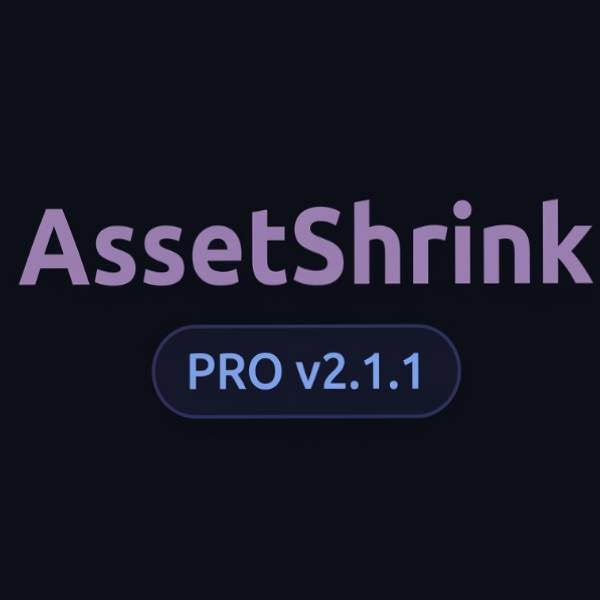
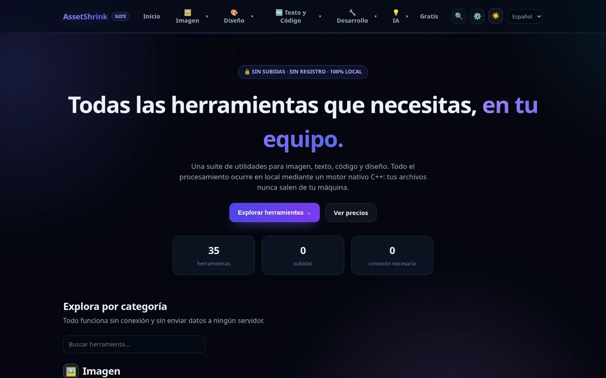
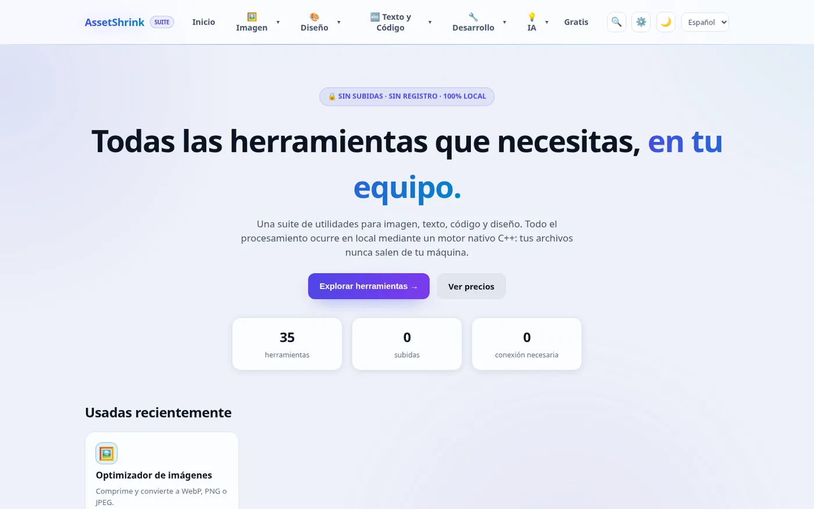
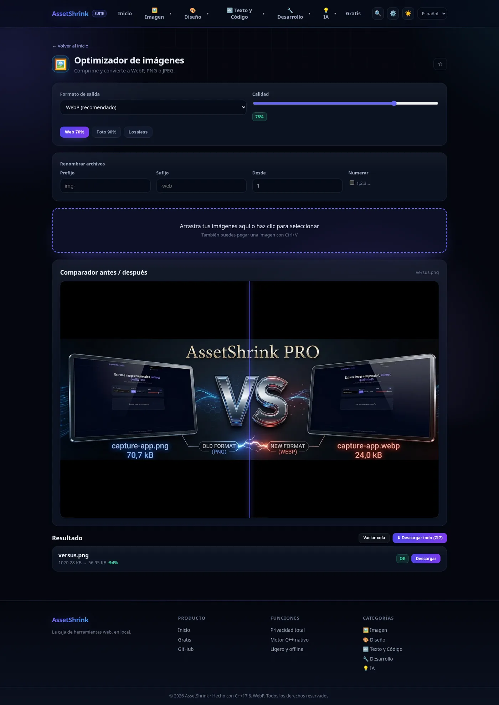
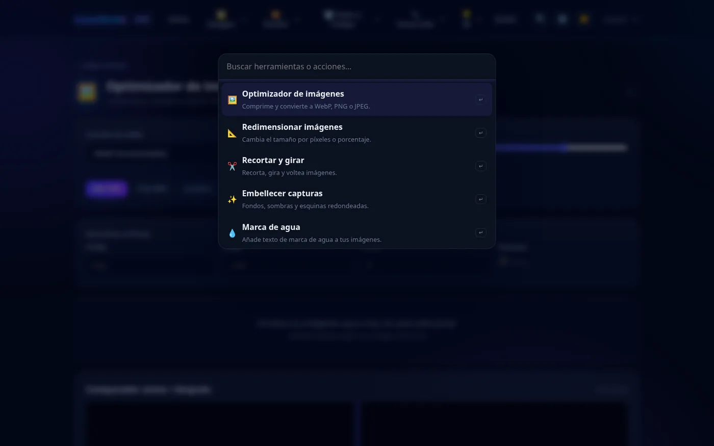
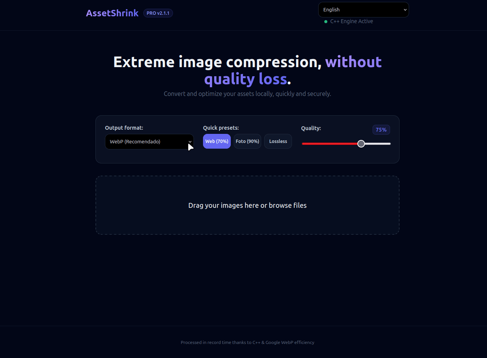
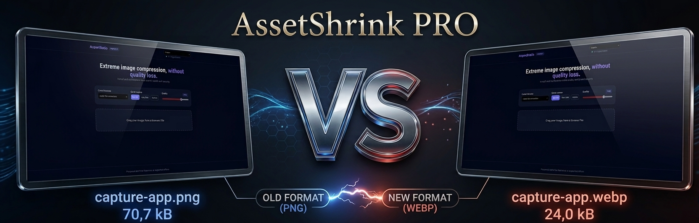

<div align="center">



# AssetShrink Suite

**35 herramientas local-first para imagen, diseño, texto/código, desarrollo e IA — en un único binario C++17.**

Sin subidas · Sin registro · Sin marcas de agua · 100 % offline

<a href="https://github.com/yosoyignicion/AssetShrink/releases/latest"></a>
<a href="LICENSE"></a>

<br>


</div>

AssetShrink es una caja de herramientas de escritorio que arranca un servidor local y abre una interfaz web en tu navegador. **Todo el procesamiento ocurre en tu equipo**: no hay subidas, ni cuentas, ni telemetría, y funciona sin conexión. Ideal para trabajar con assets confidenciales de clientes o proyectos.

---

## 🎬 Vista rápida

<table>
  <tr>
    <td width="50%" align="center"></td>
    <td width="50%" align="center"></td>
  </tr>
  <tr>
    <td align="center"><sub>Tema oscuro (sigue al sistema)</sub></td>
    <td align="center"><sub>Tema claro</sub></td>
  </tr>
  <tr>
    <td width="50%" align="center"></td>
    <td width="50%" align="center"></td>
  </tr>
  <tr>
    <td align="center"><sub>Comparador antes/después tras comprimir</sub></td>
    <td align="center"><sub>Command palette <kbd>Ctrl/Cmd</kbd>+<kbd>K</kbd></sub></td>
  </tr>
</table>

### Demo en movimiento



---

## ✨ Por qué AssetShrink



- 🔒 **Privacidad total** — procesamiento estrictamente local. Ningún archivo abandona tu dispositivo.
- 🚀 **Rendimiento nativo** — motor en C++17 (stb + libwebp) para procesar imagen en memoria, sin escrituras temporales en disco.
- 🪶 **Un único binario** — el backend y toda la interfaz (HTML/CSS/JS) van embebidos en el ejecutable. Cero dependencias en tiempo de ejecución.
- 📦 **Procesamiento por lotes** — cola de tareas para arrastrar y comprimir decenas de archivos con descarga agrupada en ZIP.
- 🌍 **Bilingüe y personalizable** — interfaz ES/EN, temas claro/oscuro, favoritos, recientes, ajustes por herramienta y exportables/importables.
- 📲 **PWA instalable** — service worker offline-first, atajos y pegado/arrastre global de imágenes.
- 💸 **Gratis y open source (MIT)** — sin cuentas, sin límites y sin marcas de agua.

---

## 🧰 Las 35 herramientas

| Categoría | Herramientas |
|-----------|--------------|
| 🖼️ **Imagen** | Optimizador · Redimensionar · Recortar y girar · Embellecer capturas · Marca de agua · Extractor de colores · Generador de favicon · Comparador de imágenes · Optimizador SVG · Convertidor de formato |
| 🎨 **Diseño** | Generador de degradados · Color y contraste (WCAG) · Generador de sombras · Cuentagotas |
| 🔤 **Texto y Código** | Contador de palabras · Convertidor de texto · Líneas de texto · Buscar y reemplazar · Comparador de textos · Editor Markdown · Herramientas JSON · Probador de Regex · Lorem ipsum |
| 🔧 **Desarrollo** | Hash y codificador · Generador de contraseñas · Generador de UUID · Generador de QR · Imagen a Base64 · Timestamp ↔ fecha · Decodificador JWT · Analizador de URL |
| 💡 **IA** | Prompts de IA · Limpiador de datos sensibles · Fragmentador semántico · Contador de tokens |

> **Backend C++** (5): Optimizador, Redimensionar, Extractor de colores, Embellecer capturas y Generador de QR.
> **Cliente** (30): el resto se ejecuta en el navegador con Canvas/JS, sin llamar al servidor.

---

## 📥 Descarga

Descarga el binario precompilado desde la [última release](https://github.com/yosoyignicion/AssetShrink/releases/latest). Descomprime y ejecuta:

| Sistema | Archivo |
|---------|---------|
| 🐧 **Linux x64** | [`AssetShrink-linux-x64.zip`](https://github.com/yosoyignicion/AssetShrink/releases/download/v3.2.0/AssetShrink-linux-x64.zip) |
| 🪟 **Windows x64** | [`AssetShrink-windows-x64.zip`](https://github.com/yosoyignicion/AssetShrink/releases/download/v3.2.0/AssetShrink-windows-x64.zip) |
| 🍎 **macOS (universal)** | [`AssetShrink-macos-universal.zip`](https://github.com/yosoyignicion/AssetShrink/releases/download/v3.2.0/AssetShrink-macos-universal.zip) |

```bash
./AssetShrink          # Linux / macOS
.\AssetShrink.exe      # Windows
```

Se abre automáticamente en `http://localhost:8080`, eligiendo el primer puerto libre entre **8080–8089**.

> **💡 Opciones de línea de comandos** — `--help` · `--version` · `--port <n>` · `--no-open`

---

## 🔧 Compilar desde código fuente

> *No necesitas compilar si usaste un binario precompilado. Esta sección es para desarrolladores.*

**Requisitos**

```bash
# Linux
sudo apt update && sudo apt install cmake build-essential libwebp-dev pkg-config

# macOS
brew install webp pkg-config
```

**Compilar y ejecutar**

```bash
cmake -B build
cmake --build build
./build/AssetShrink
```

**Verificación**

```bash
scripts/smoke.sh        # arranca el binario y valida todos los endpoints
scripts/check_i18n.sh   # comprueba que toda clave t("...") exista en ES y EN
```

---

## 🏗️ Arquitectura

- **Backend** (`src/core/`, `src/tools/`) — `image_io` (stb + stb_image_resize2 + WebP) y `assets` (búsqueda de assets embebidos + MIME); herramientas modulares registradas vía `register_<tool>(httplib::Server&)`.
- **Frontend** (`src/web/`) — SPA vanilla-JS (ES modules, router History API), un módulo por herramienta, i18n ES/EN, PWA (manifest + service worker) y ZIP sin dependencias.
- **Assets embebidos** en build-time (`cmake/embed_assets.cmake`, `file(READ ... HEX)` → `assets_generated.cpp`): todo se sirve desde memoria en un solo binario.
- **API local** — `POST /api/convert`, `/api/resize`, `/api/palette`, `/api/beautify`, `GET /api/qr`. Rutas `/`, `/pricing` y `/tools/<slug>` inyectan meta SEO por ruta desde `seo.txt`.
- **Versión** — única fuente en `CMakeLists.txt` → `config.h` generado.

Detalles completos para agentes/contribuidores en [`AGENTS.md`](AGENTS.md).

---

## 🧩 Dependencias y licencias de terceros

Este proyecto es posible gracias a extraordinarias librerías de la comunidad, enlazadas de forma estática y respetando sus licencias:

- **[stb](https://github.com/nothings/stb)** (Dominio Público / MIT) — Lectura y escritura de imágenes en memoria.
- **[cpp-httplib](https://github.com/yhirose/cpp-httplib)** (MIT) — Servidor HTTP ligero y de alto rendimiento.
- **[libwebp](https://chromium.googlesource.com/webm/libwebp)** (BSD-3-Clause, Google) — Codificación/decodificación WebP.
- **[QR Code generator](https://github.com/nayuki/QR-Code-generator)** (MIT, Nayuki) — Generación de códigos QR.

---

## 📄 Licencia

MIT — consulta el archivo [LICENSE](LICENSE) para más detalles.

<div align="center"><sub>Hecho con C++17 & WebP. Tus datos, en tu máquina.</sub></div>
